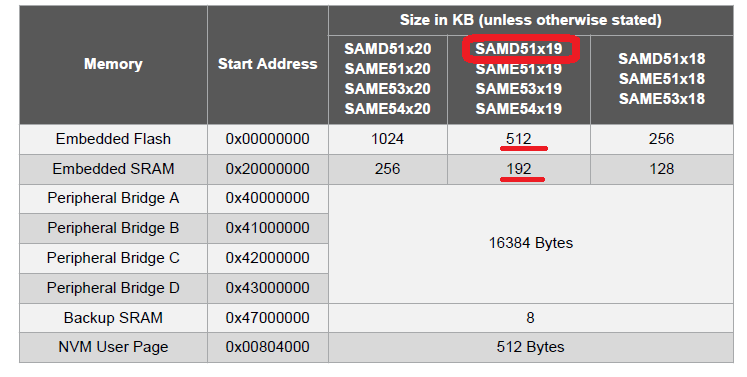
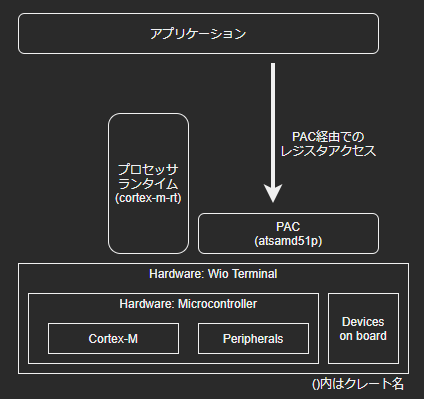
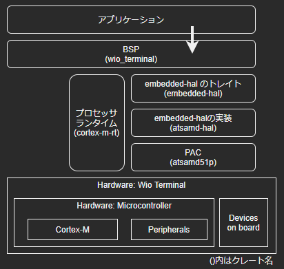
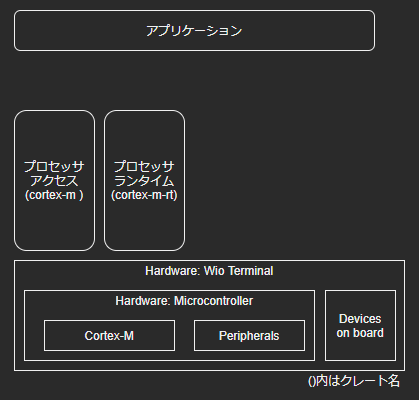

# 組込みRustをボトムアップで試す - レジスタ直叩き、PAC、HAL、BSP -

# この記事について
- 組込みプログラミングをRustで行います
- Wio Terminalをターゲットに「ボタンを押したらLEDが光る」というアプリケーションを、以下のそれぞれの方法で作ります
    - レジスタ直叩き
    - PAC (Peripheral access crates) を使う
    - HAL (Hardware Abstraction Layer) を使う
    - BSP (Board Support Package) を使う
- Wio Terminalをターゲットに「Lチカ」するアプリケーションを、以下のそれぞれの方法で作ります
    - プロセッサアクセス を使う
    - BSP (Board Support Package) を使う
- 書籍「基礎から学ぶ 組込みRust」の第5章で説明されている内容をやってみた、という記事になります
    - 組込みでRustを使う際は、基本的にはHALやBSPを使うことが多いと思います。書籍でも、BSPを用いてWioの各デバイスを制御する方法が主に説明されています
    - ただ、実際に何がどうなっているのかの理解が自分は十分にできなかったため、あえて基礎的なところから順に抽象度を上げていこうと思います
    - 書籍でもこの内容は第5章で説明されています。本記事はこの部分を深堀した内容になります

## 対象とする方
- 組込みRustに興味がある方
- Rustの基本的なコードが書ける方
- 書籍「基礎から学ぶ 組込みRust」をやってみた方
    - 最低限、第4章の内容は試した方

## 環境構築
- ハードウェア
    - Wio Terminal
        - CPU: Microchip ATSAMD51P19 (ARM Cortex-M4F @ 120 MHz)
- Rust: https://rustup.rs/
    - Linux
        ```
        sudo apt install gcc
        curl --proto '=https' --tlsv1.2 -sSf https://sh.rustup.rs | sh
        ```
    - Windows
        - Visual Studio 2019 + C++ Build Tools
        - https://win.rustup.rs/x86_64
- Cross build tool + binary tool
    ```
    rustup target add thumbv7em-none-eabihf
    cargo install cargo-generate
    cargo install hf2-cli
    cargo install cargo-hf2
    ```
- Others (if needed)
    - Serial terminal (not used in this project)
    - VSCode + rust-analyzer


# 必用最低限のプロジェクトを作る
- まずはベースとなる、Wioに書き込み可能なプログラムを作成します。動作は何もせず、無限ループするだけのコードになります
- https://github.com/iwatake2222/rust_embedded_wio_bottom_up/pj_00_empty

## クレート
- 以下のクレートが必要になります
- cortex_m_rt (プロセッサランタイム)
    - https://docs.rs/cortex-m-rt/0.7.0/cortex_m_rt/
    - マイコン上で動くプログラムであるため、起動ルーチンや割り込みベクタテーブル等が必要になります
    - そこら辺をやってくれるクレートです
- panic-halt
    - panic発生時にhaltするために必要です

```toml:Cargo.toml
[package]
name = "pj_xxx"
version = "0.1.0"
edition = "2018"

[dependencies]
panic-halt = "0.2"
cortex-m-rt = "0.7.0"
```

## リンカスクリプトの設定
- プログラムを書き込んだり実行する際に、ROMやRAMの場所(アドレス)、割り込みベクタの場所(アドレス)が必用になります
- これらはバイナリ生成時に決まります。そのために、各領域(SECTION)を定義したリンカスクリプトが必要になります
- Cortex-M用のリンカスクリプトはcortex_m_rtクレートが自動的に生成してくれます。`link.x` という名前になります
- コンパイラに対して、この`link.x` をリンカスクリプトとして使用するように指定します
    - Cortex-M用なので、targetがthumbv7em-none-eabihfの場合のみこれを使用するようにしています
    - ついで、デフォルトのビルドtargetをthumbv7em-none-eabihfにしています
    - ついでに、`cargo run` したときにhf2を使って書き込みまで行うようにrunnerを設定しています
- この設定を忘れると、ビルドは成功しますがhf2を使った書き込み時にエラーが発生します
    - `thread 'main' panicked at 'called `Result::unwrap()` on an `Err` value: InvalidBinary', `

```txt:.cargo/config
[build]
target = "thumbv7em-none-eabihf"

[target.thumbv7em-none-eabihf]
runner = "hf2 elf"
rustflags = [
  "-C", "link-arg=-Tlink.x",
]
```

### メモリレイアウト
- cortex_m_rtは、Wio用でもATSAMD51P19用でもなく、「Cortex-M」のためのランタイムです
- そのため、マイコン個別の設定(メモリレイアウト)が別途必要になります
- `link.x`は、`memory.x` という名前のファイルにメモリレイアウトが記載されていることを期待し、読み込もうとします
    - cargoコマンドを実行するのと同じ階層(Cargo.tomlと同じ階層)に配置します
    - 他の説明を見ると、`build.rs` を用意してビルド時にoutフォルダにコピーするようにする必要があるようですが、無くても大丈夫でした
- このファイルが無かったり、ミスがるとビルド時にリンクエラーが発生します
    - `error: linking with `rust-lld` failed: exit code: 1`
- メモリレイアウトは、通常はマイコンのデータシートに記載のメモリマップを元に作成します。が、今回は下記に既に正解があるのでこれを使いました
    - https://docs.rs/crate/wio_terminal/0.2.0/source/memory.x

```txt:memory.x
MEMORY
{
  /* Leave 16k for the default bootloader on the Wio Terminal */
  FLASH (rx)  : ORIGIN = 0x00000000 + 16K, LENGTH = 512K - 16K
  RAM   (rxw) : ORIGIN = 0x20000000, LENGTH = 192K
}
_stack_start = ORIGIN(RAM) + LENGTH(RAM);
```

### 参考: メモリマップ
ATSAMD51のデータシートに記載の物理メモリマップ




## コード
下記が、何もしない一番最小限のコードです。main関数そのものには意味はなく、entryポイントとなる関数をマクロを使って指定します。このマクロはcortex_m_rtクレートによって提供されます。

```rust:最小限のコード
#![no_std]
#![no_main]

use panic_halt as _;
use cortex_m_rt::entry;

#[entry]
fn main() -> ! {
    loop {}
}
```

# 例題とするアプリケーション
ここから、以下の動作をするアプリケーションを色々な方法で作ります

- Button1が押されていなかったら、USER_LEDをONにする
- Button1が押されていたら、USER_LEDをOFFにする


# レジスタ直叩きでペリフェラルを制御する
- まず最初に、レジスタ直叩きでコードを実装してみます
- https://github.com/iwatake2222/rust_embedded_wio_bottom_up/pj_01_gpio_by_register


## 開発者が知っておく必要があるハードウェア情報
レジスタ直叩きで制御する場合には、開発者は以下の情報をデータシートや回路図などを読み解き、調査、理解する必要があります。大変ですね。

- USER_LEDはPA15に接続されている
- Button1ははPC26に接続されている (回路上でプルアップされている)
- GPIOを出力にするには、DIRレジスタの所定のビットをsetする
- GPIOを入力にするには、DIRレジスタの所定のビットをclrする。さらに、Input Enableする必要がある
- 各レジスタのアドレスは以下の通りである
    - PORT_ADDRESS = 0x4100_8000;
    - PA_ADDRESS = PORT_ADDRESS + 0x80 * 0;
    - PC_ADDRESS = PORT_ADDRESS + 0x80 * 2;
    - PA_DIRSET = 0x4100_8000 + 0x08;
    - PA_OUTCLR = 0x4100_8000 + 0x14;
    - PA_OUTSET = 0x4100_8000 + 0x18;
    - PC_DIRCLR = 0x4100_8100 + 0x04;
    - PC_PINCFG26 = 0x4100_8100 + 0x40 + 26;
    - PC_IN = 0x4100_8100 + 0x20;

## コード
上記情報を調査したうえで、仕様通りに制御したコードが下記になります。

```rust:レジスタ直叩きのコード
#![no_std]
#![no_main]

use panic_halt as _;

use cortex_m_rt::entry;

#[entry]
fn main() -> ! {
    unsafe {
        /* Register address */
        const PORT_ADDRESS: u32 = 0x4100_8000;
        const PA_ADDRESS: u32 = PORT_ADDRESS + 0x80 * 0;
        const PC_ADDRESS: u32 = PORT_ADDRESS + 0x80 * 2;
        const PA_DIRSET: u32 = PA_ADDRESS + 0x08;
        const PA_OUTCLR: u32 = PA_ADDRESS + 0x14;
        const PA_OUTSET: u32 = PA_ADDRESS + 0x18;
        const PC_DIRCLR: u32 = PC_ADDRESS + 0x04;
        const PC_PINCFG26: u32 = PC_ADDRESS + 0x40 + 26;
        const PC_IN: u32 = PC_ADDRESS + 0x20;
        const PA_BIT_LED: u32 = 15;
        const PC_BIT_BUTTON1: u32 = 26;

        /* Set pin configuration */
        *(PA_DIRSET as *mut u32) = 1 << PA_BIT_LED;         // USER_LED = PA15 = Output
        *(PC_DIRCLR as *mut u32) = 1 << PC_BIT_BUTTON1;     // Button1 = PC26 = Input
        *(PC_PINCFG26 as *mut u32) |= 1 << 1;               // Button1 = PC26 = Input Enable

        loop {
            let button1_input = *(PC_IN as *mut u32) & 1 << PC_BIT_BUTTON1;
            if button1_input > 0 {
                /* Button is not pressed */
                *(PA_OUTSET as *mut u32) = 1 << PA_BIT_LED;
            } else {
                /* Button is pressed */
                *(PA_OUTCLR as *mut u32) = 1 << PA_BIT_LED;
            }
        }
    }
}
```

## 問題点
- この方法には下記のような問題点があります
    - コードにボード(Wio)依存の情報がある
        - 制御したいのはUSER_LEDですが、USER_LED=PA15という情報がコード内に入っています
    - コードにATSAMD51マイコン依存の情報がある
        - レジスタのアドレス
        - レジスタの制御方法 (どのレジスタをどのように設定する必要があるか)
- 結果として、開発者は本来作りたいアプリケーション開発に専念できませんし、移植性も悪くなります


# PACを用いてペリフェラルを制御する
- 次に、PAC (Peripheral access crates) を用いてみます。PACがレジスタアクセス用のAPIを提供してくれるため、レジスタのアドレス情報は知っておく必要が無くなります
- https://github.com/iwatake2222/rust_embedded_wio_bottom_up/pj_02_gpio_by_pac



## 開発者が知っておく必要があるハードウェア情報
- USER_LEDはPA15に接続されている
- Button1ははPC26に接続されている (回路上でプルアップされている)
- GPIOを出力にするには、DIRレジスタの所定のビットをsetする
- GPIOを入力にするには、DIRレジスタの所定のビットをclrする。さらに、Input Enableする必要がある

## クレート
- atsamd51p (PAC)
    - https://docs.rs/atsamd51p/0.11.0/atsamd51p/
    - ATSAMD51PマイコンのペリフェラルへアクセスするためのAPIを提供してくれるクレートです
    - 注意点として、このクレートが提供するのは、「マイコンのペリフェラルへのアクセス」です。プロセッサ(Cortex-M)の機能 (SysTickや割り込み、FPUなど)は管轄外です

```toml:Cargo.toml
[dependencies]
panic-halt = "0.2"
cortex-m-rt = "0.7.0"
atsamd51p = "0.11.0"
```

## コード
```rust:PACを用いたコード
#![no_std]
#![no_main]

use panic_halt as _;

use cortex_m_rt::entry;
use atsamd51p;

#[entry]
fn main() -> ! {
    const PA_BIT_LED: u32 = 15;
    const PC_BIT_BUTTON1: u32 = 26;

    let peripherals = atsamd51p::Peripherals::take().unwrap();

    unsafe {
        peripherals.PORT.group0.dirset.write(|w| w.bits(1 << PA_BIT_LED));         // USER_LED = PA15 (Group0_15) = Output
        peripherals.PORT.group2.dirclr.write(|w| w.bits(1 << PC_BIT_BUTTON1));     // Button1 = PC26 (Group2_26) = Input
        peripherals.PORT.group2.pincfg[26].write(|w| w.bits(1 << 1));                // Button1 = PC26 (Group2_26) = Input Enable

        loop {
            let button1_input = peripherals.PORT.group2.in_.read().bits() & (1 << PC_BIT_BUTTON1);
            if button1_input > 0 {
                /* Button is not pressed */
                peripherals.PORT.group0.outset.write(|w| w.bits(1 << PA_BIT_LED));    // USER_LED = PA15 (Group0_15) = Set
            } else {
                /* Button is pressed */
                peripherals.PORT.group0.outclr.write(|w| w.bits(1 << PA_BIT_LED));    // USER_LED = PA15 (Group0_15) = Clr
            }
        }
    }
}
```


# HALを用いてペリフェラルを制御する
- 次に、HAL (Hardware Abstraction Layer) を用いてみます。HALがデバイス依存の制御を吸収し、一般的なAPIを提供してくれます
- これによってだいぶコードがすっきりします。また、アプリケーション側のコードからunsafeを取り除くことができます。
- https://github.com/iwatake2222/rust_embedded_wio_bottom_up/pj_03_gpio_by_hal


## 開発者が知っておく必要があるハードウェア情報
- USER_LEDはPA15に接続されている
- Button1ははPC26に接続されている (回路上でプルアップされている)

## クレート
- embedded-hal (HAlのトレイト)
    - https://docs.rs/embedded-hal/0.2.6/embedded_hal/
    - デバイス依存の制御を吸収し、一般的なAPIを提供してくれるクレートです
    - このクレートはトレイトであり、別途ターゲットマイコン用にHALを実装したクレートが必要になります
    - なお、HAL実装クレートを追加すると、自動的に本embedded-halクレートも追加されるためCargo.tomlへの追加は不要です
- atsamd-hal (HALの実装)
    - https://docs.rs/atsamd-hal/0.13.0/atsamd_hal/
    - ATSAMDマイコンを対象としてHALを実装したクレートです
    - ATSAMDのさらにどのシリーズかをfeaturesで指定する必要があります。指定しないとtarget不明エラーが出ます
        - WioはATSAMD51P19マイコンを搭載しているため、`samd51p` を指定します
- atsamd51p (PAC)は、atsamd-halを追加すると自動的に追加されるため不要です
- cortex-m-rt (プロセッサランタイム) は引き続き必用になります。

```toml:Cargo.toml
[dependencies]
panic-halt = "0.2"
cortex-m-rt = "0.7.0"
# atsamd51p = "0.11.0"
# embedded-hal = "0.2.6"
atsamd-hal =  {version="0.13.0", features=["samd51p"]}
```

## コード
```rust:HALを用いたコード
#![no_std]
#![no_main]

use panic_halt as _;
use cortex_m_rt::entry;
use atsamd_hal::{prelude::*, gpio::v2::Pins};

#[entry]
fn main() -> ! {
    let peripherals = atsamd_hal::pac::Peripherals::take().unwrap();
    // let peripherals = atsamd_hal::target_device::Peripherals::take().unwrap();   // same

    // let mut pins = peripherals.PORT.split();      // gpio v1 is deprecated
    let pins = Pins::new(peripherals.PORT);     // so, use gpio v2
    let mut led = pins.pa15.into_push_pull_output();       // USER_LED = PA15 = Output
    let button1 = pins.pc26.into_floating_input(); // Button1 = PC26 = Input

    loop {
        if button1.is_high().unwrap() {
            /* Button is not pressed */
            led.set_high().unwrap();
        } else {
            /* Button is pressed */
            led.set_low().unwrap();
        }
    }
}
```


# BSPを用いてペリフェラルを制御する
- 次に、BSP (Board Support Package) を用いてみます。BSPがボード依存(今回の場合、Wio Terminal依存) の制御を吸収してくれます。そのため、「USER_LED」とか「Button1」というWioで使われている名前を使えます
- 今回の場合は制御対象がGPIOだけなのであまりメリットはありません。実際、GPIOなどの簡単なデバイスに関しては、atsamd-halをre-exportしているだけです。そのため、コードもHALを用いた場合とほぼ同じです
- BSPは他にも光センサや液晶ディスプレイを使うためのAPIも提供してくれます。HALだけだと、開発者がADCやSPIをHAL経由で使って、対象となるセンサや液晶ディスプレイを制御する必要があります。が、BSPはボードに搭載されたデバイスを使うためのAPIも提供してくれます
- https://github.com/iwatake2222/rust_embedded_wio_bottom_up/pj_04_gpio_by_bsp



## 開発者が知っておく必要があるハードウェア情報
- なし
    - せいぜい、Button1がプルアップされているので、押されていないとHigh、押されたらLowになるという情報くらい

## クレート
- wio_terminal (BSP)
    - https://docs.rs/wio_terminal/0.4.0/wio_terminal/
    - ボード(Wio Terminal)依存の制御を吸収し、ボードに搭載されているデバイスにアクセスするための一般的なAPIを提供してくれるクレートです
    - なお、本BSPクレートを追加すると、他に必要なクレートも自動的に追加されるためCargo.tomlへの追加は不要です
    - また、memory.xも本BSPクレートが良しなにやってくれるようなので、不要になります

```toml:Cargo.toml
[dependencies]
panic-halt = "0.2"
wio_terminal = "0.3"
```

## コード
```rust:BSPを用いたコード
#![no_std]
#![no_main]

use panic_halt as _;
use wio_terminal as wio;

use wio::entry;
use wio::prelude::*;

#[entry]
fn main() -> ! {
    let peripherals = wio::pac::Peripherals::take().unwrap();

    let mut pins = wio::Pins::new(peripherals.PORT);
    let mut led = pins.user_led.into_push_pull_output(&mut pins.port);
    let button1 = pins.button1.into_floating_input(&mut pins.port);
    
    loop {
        if button1.is_high().unwrap() {
            /* Button is not pressed */
            led.set_high().unwrap();
        } else {
            /* Button is pressed */
            led.set_low().unwrap();
        }
    }
}
```


# 例題とするアプリケーション (Lチカ)
- プロセッサアクセスの説明のため、ここからは別のアプリケーションを例題とします。
- ここからは、以下の動作をするアプリケーションを作ります
- Lチカ
    - プロセッサ(Cortex-M)内のSysTickを用いて、1秒周期でLEDをOn/Offさせる


# プロセッサアクセスを用いて、プロセッサ固有の機能を制御する
- ここまで説明してきたHALは、主にマイコンのペリフェラル(I/O)にアクセスする手段を提供します。そのため、マイコンのプロセッサ(Cortex-M)にアクセスする手段は提供しません
- マイコンのプロセッサ(Cortex-M)にアクセスするためには別途、プロセッサアクセスを用います
- https://github.com/iwatake2222/rust_embedded_wio_bottom_up/pj_05_blink_by_processor_access



## クレート
- cortex-m (プロセッサアクセス)
    - https://docs.rs/cortex-m/0.7.3/cortex_m/
    - Cortex-Mプロセッサへアクセスするための低レベルAPIを提供します
        - NVIC, SCB, SysTickなどへのアクセス
        - CONTROL, MSP, PSRレジスタなどへのアクセス

```toml:Cargo.toml
[dependencies]
panic-halt = "0.2"
cortex-m-rt = "0.7.0"
cortex-m = "0.7.3"
```

## コード
- LED制御のコードは、一番最初のレジスタ直叩きに戻しています
- 「低レベル」とはいえSysTickを用いたdelayモジュールは提供してくれていますので、これを使います
    - delayを正しく動かすために、AHBクロックの値を設定する必要があります
    - 120MHzを指定したらうまく動かず、少し変えた値を設定しました
    - おそらく、クロックジェネレータの設定をしていないためだと思われます(後述)

```rust:プロセッサアクセスを用いて、プロセッサ固有の機能を制御する
#![no_std]
#![no_main]

use panic_halt as _;

use cortex_m_rt::entry;
use cortex_m;

#[entry]
fn main() -> ! {

    unsafe {
        /* Register address */
        const PORT_ADDRESS: u32 = 0x4100_8000;
        const PA_ADDRESS: u32 = PORT_ADDRESS + 0x80 * 0;
        const PA_DIRSET: u32 = PA_ADDRESS + 0x08;
        const PA_OUTCLR: u32 = PA_ADDRESS + 0x14;
        const PA_OUTSET: u32 = PA_ADDRESS + 0x18;
        const PA_BIT_LED: u32 = 15;

        /* Set pin configuration */
        *(PA_DIRSET as *mut u32) = 1 << PA_BIT_LED;         // USER_LED = PA15 = Output

        /* Get delay driver based on SysTick */
        let core = cortex_m::Peripherals::take().unwrap();
        const AHB_CLK_MHZ: u32 = (120.0 / 2.5) as u32;
        let mut delay = cortex_m::delay::Delay::new(core.SYST, AHB_CLK_MHZ * 1000000);
        
        loop {
            /* Blink LED */
            delay.delay_ms(1000);
            *(PA_OUTSET as *mut u32) = 1 << PA_BIT_LED;
            delay.delay_ms(1000);
            *(PA_OUTCLR as *mut u32) = 1 << PA_BIT_LED;
        }
    }
}
```


# BSPを用いて、プロセッサ固有の機能を制御する
- BSP経由でプロセッサ固有の機能にもアクセスできます。実際にはGPIO(HAL)と同様に、プロセッサアクセスをre-exportしているだけなのでdelayに関する部分は先ほどのコードとほとんど同じになります
- https://github.com/iwatake2222/rust_embedded_wio_bottom_up/pj_06_blink_by_bsp


## クレート
- wio_terminal (BSP)
    - HALと同様に、本BSPクレートを追加するとプロセッサアクセスクレートも自動的に追加されます

```toml:Cargo.toml
[dependencies]
panic-halt = "0.2"
wio_terminal = "0.3"
```

## コード
- LED制御のコードは、BSPを用いたコードにしています
- delayに関する部分はプロセッサアクセスを用いたものと似た雰囲気になっていますが、引数がAHBクロックの数値から、clocksに変わっています
    - ちなみに `delay_ms` も名前は同じですが、ここではHALで定義された`delay_ms` を呼んでいます
- BSP経由でクロックジェネレータの設定もしています

```rust:BSPを用いて、プロセッサ固有の機能を制御する
#![no_std]
#![no_main]

use panic_halt as _;
use wio_terminal as wio;

use wio::entry;
use wio::prelude::*;


#[entry]
fn main() -> ! {
    let mut peripherals = wio::pac::Peripherals::take().unwrap();
    let core = wio::pac::CorePeripherals::take().unwrap();

    /* Initialize clock controller */
    let mut clocks = wio::hal::clock::GenericClockController::with_external_32kosc(
        peripherals.GCLK,
        &mut peripherals.MCLK,
        &mut peripherals.OSC32KCTRL,
        &mut peripherals.OSCCTRL,
        &mut peripherals.NVMCTRL,
    );

    /* Get delay driver based on SysTick */
    let mut delay = wio::hal::delay::Delay::new(core.SYST, &mut clocks);

    /* Set pin configuration */
    let mut pins = wio::Pins::new(peripherals.PORT);
    let mut led = pins.user_led.into_push_pull_output(&mut pins.port);
    
    loop {
        /* Blink LED */
        delay.delay_ms(1000u16);
        led.set_high().unwrap();
        delay.delay_ms(1000u16);
        led.set_low().unwrap();
    }
}
```


# おわりに
レジスタ直叩きから始めて、HAL、BSPを使う方法へと順を追って進めてみました。実際の開発ではHAL、BSPを使うことになると思います。本記事ではGPIOのみを対象としましたが、他の色々なサンプルは書籍「基礎から学ぶ 組込みRust」に沢山あるため、ぜひそちらをご参照ください。

# 参考
- 基礎から学ぶ 組込みRust
- 実践Rustプログラミング入門
